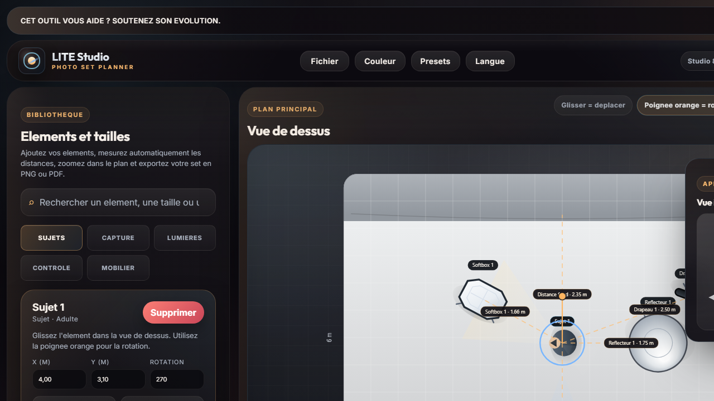
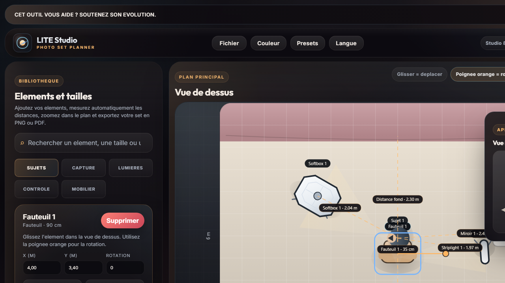
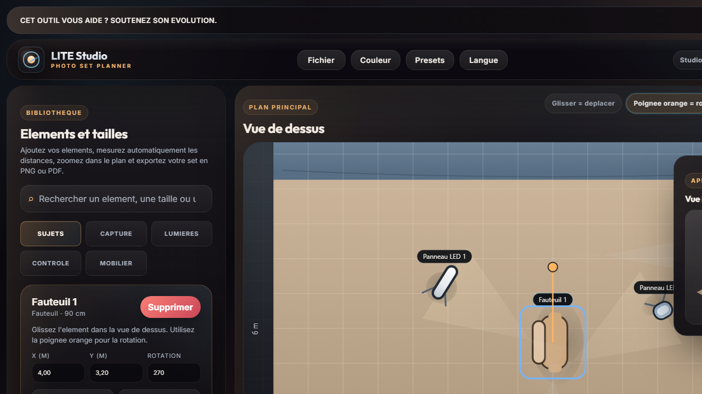

[](https://ko-fi.com/D1D21VSKW5)

Langues : [Français](README.md) · [FR](README.fr.md) · [English](README.en.md) · [Español](README.es.md) · [Deutsch](README.de.md) · [العربية](README.ar.md)

# LITE Studio

LITE Studio est une application web autonome pour preparer un plan de studio photo sur desktop et mobile.

Elle aide a construire rapidement un set, mesurer les distances utiles du plateau, zoomer dans le plan, sauvegarder des presets personnalises et exporter le schema en PNG ou PDF.

## Captures d'ecran

### Vue principale - preset portrait



### Preset boudoir



### Preset video interview



## Fonctionnalites

- Interface responsive utilisable sur mobile et desktop.
- Vue de dessus avec zoom, molette sur desktop, pinch-to-zoom sur mobile et apercu isometrique zoombable.
- Bibliotheque d'elements avec recherche par type, taille ou famille.
- Mesures automatiques entre sujet, camera, fond et sources, plus un mode de mesure manuel.
- Reglages d'element et informations metier : hauteur, orientation, puissance source et lecture estimee a ISO 100.
- Presets integres et presets personnalises sauvegardes dans le navigateur.
- Export PNG, export PDF et impression directe du plan.
- Interface multilingue : francais, anglais, espagnol, allemand et arabe.

## Demarrage rapide

Aucune installation n'est necessaire.

1. Ouvrez [app.html](app.html) dans un navigateur moderne pour lancer l'application, ou [index.html](index.html) pour la landing.
2. Ajoutez des elements depuis la bibliotheque.
3. Deplacez-les dans le plan et tournez-les avec la poignee orange.
4. Utilisez la molette sur desktop ou le pinch sur mobile pour zoomer dans la vue de dessus.
5. Activez `Mesure` pour afficher les distances autour du sujet ou tracer une mesure manuelle.
6. Utilisez le menu `Presets` pour charger un preset ou sauvegarder votre propre configuration.
7. Utilisez le menu `Fichier` pour copier l'image, exporter en PNG ou PDF, ou imprimer le plan.

## Structure du projet

- `index.html` : landing page publique.
- `app.html` : application de plan de studio photo.
- `css/simple-studio.css` : design, responsive, mise en page et styles d'impression.
- `css/site.css` : styles de la landing et des pages editoriales.
- `js/simple-studio.js` : logique du studio, rendu canvas, langues, presets, mesures et interactions.
- `js/site-i18n.js` et `js/site-copy-*.js` : contenus et localisation des pages publiques.
- `guide.html`, `presets.html`, `faq.html` : pages d'explication et d'accompagnement.
- `schema-eclairage-portrait.html`, `plan-studio-boudoir.html`, `lighting-diagram-interview.html` : pages ciblees SEO reliees a l'application.
- `docs/screenshots/` : captures d'ecran utilisees dans le README et les apercus.

## Parametres d'URL utiles

Des parametres simples peuvent etre utilises pour ouvrir directement une langue ou un preset :

- `?lang=fr`
- `?lang=en`
- `?lang=es`
- `?lang=de`
- `?lang=ar`
- `?preset=portrait-soft-45`
- `?preset=boudoir-parabolic`
- `?preset=interview-led`

Exemple :

```text
index.html?preset=portrait-soft-45&lang=fr
```

## Soutien

Si cet outil vous est utile, vous pouvez soutenir son evolution ici :

[Ko-fi](https://ko-fi.com/D1D21VSKW5)
